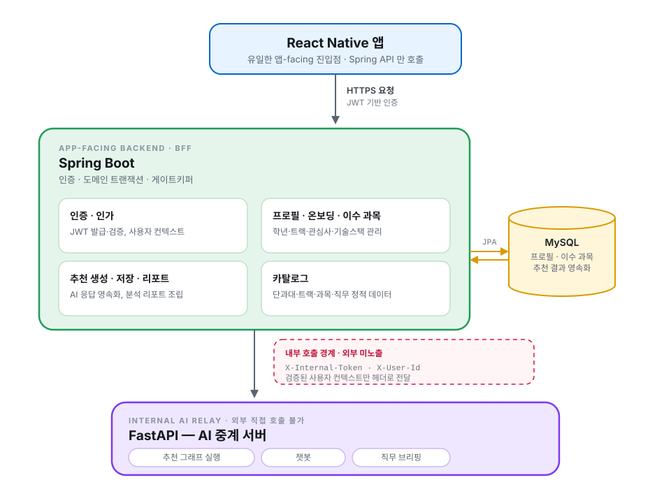

# tracktory-backend

tracktory 메인 백엔드 (Spring Boot 4.0.x · Java 21).
사용자 인증·프로필·이수 과목·트랙/직무/과목 도메인을 담당하며, AI 처리는 내부 중계 서버 (FastAPI) 로 위임한다.

상세 컨벤션은 [`CONTRIBUTING.md`](./CONTRIBUTING.md), AI 에이전트 컨텍스트는 [`CLAUDE.md`](./CLAUDE.md) 참조.

---

## Architecture

tracktory-backend 는 앱과 직접 통신하는 **유일한 앱-facing 백엔드(BFF)** 입니다. React Native 앱은 Spring Boot API 만 호출하고, 추천·챗봇·직무 브리핑처럼 AI 연산이 필요한 요청은 Spring 이 내부 FastAPI 서버로 중계합니다.

Spring 의 책임은 인증, 도메인 트랜잭션, 사용자 프로필과 이수 과목 관리, 추천 결과 저장과 리포트 조립입니다. AI 서버는 외부에 직접 노출하지 않고, Spring 이 검증한 사용자 컨텍스트만 내부 헤더로 전달합니다.



## Responsibilities

| 영역 | 책임 |
|---|---|
| 인증 · 인가 | 회원가입/로그인, JWT 발급·검증, 인증 사용자 컨텍스트 제공 |
| 프로필 · 온보딩 | 학년, 소속, 트랙, 관심사, 개발 분야, 근무 가치관, 기술스택 저장·조회 |
| 이수 과목 | 사용자 이수 과목 추가·삭제, 추천 재계산을 위한 변경 이벤트 발행 |
| 추천 생성 · 저장 | 온보딩 스냅샷을 AI 서버로 전달하고, 직무·트랙·로드맵·역량 분석 결과를 DB 에 저장 |
| 추천 리포트 | 활성 추천 기준 상세 분석 리포트와 기준 직무별 역량 충족도를 조립 |
| AI 중계 | 추천, 챗봇, 직무 브리핑 요청을 내부 FastAPI API 로 위임 |
| 카탈로그 | 단과대, 학부, 트랙, 과목, 직무, 기술스택 등 정적 학사/직무 데이터를 로드·조회 |

## Internal AI Boundary

Spring Boot 는 FastAPI AI 중계 서버를 내부 서비스로만 호출합니다.

| 헤더 | 의미 |
|---|---|
| `X-Internal-Token` | Spring ↔ FastAPI 사이의 내부 호출 인증 토큰 |
| `X-User-Id` | Spring 이 JWT 로 검증한 사용자 ID 를 AI 서버에 전달하는 envelope 헤더 |

앱은 FastAPI 서버를 직접 호출하지 않습니다. 사용자 인증과 도메인 데이터 접근은 Spring 에서 끝내고, AI 서버는 추천·챗봇 그래프 실행에 집중합니다.

## Recommendation Cache & Invalidation

추천 생성 API 는 `forceRefresh=false` 일 때 사용자의 최신 `ACTIVE` 추천이 있으면 AI 서버를 다시 호출하지 않고 기존 추천을 조립해 반환합니다. `forceRefresh=true` 이거나 활성 추천이 없으면 새 추천을 생성하고, 기존 활성 추천은 `SUPERSEDED` 처리합니다.

이수 과목이 추가·삭제되면 `CompletedSubjectsChangedEvent` 가 발행되고, `RecommendationInvalidationListener` 가 해당 사용자의 활성 추천을 무효화합니다. 이후 사용자가 다시 추천을 요청하면 변경된 이수 과목 기준으로 새 추천이 생성됩니다.

## Domain Packages

| Package | 역할 |
|---|---|
| `auth` | 회원가입, 로그인, JWT 기반 인증 진입점 |
| `profile` | 온보딩, 사용자 프로필, 이수 과목 관리 |
| `recommendation` | 추천 생성 오케스트레이션, AI 응답 영속화, 리포트 조립, 추천 무효화 |
| `chatbot` | 사용자 프로필 컨텍스트를 조립해 AI 챗봇 서버로 중계 |
| `briefing` | AI 직무 브리핑 서버 호출과 응답 변환 |
| `catalog` | 학사 조직, 트랙, 과목, 직무, 기술스택 카탈로그 엔티티와 seed loader |
| `user` | 사용자 엔티티, 인증 principal, 사용자 조회 |
| `global` | 응답 envelope, 예외 처리, 보안, WebClient, request-id 등 공통 인프라 |

## Main APIs

| Method | Endpoint | 역할 |
|---|---|---|
| `POST` | `/api/v1/recommendations` | 인증 사용자의 온보딩 데이터로 추천을 생성하거나 활성 추천을 반환 |
| `GET` | `/api/v1/recommendations/report` | 활성 추천 기준 분석 리포트 조회. `anchorJobCode` 로 기준 직무 선택 가능 |
| `POST` | `/api/v1/chatbot/message` | 사용자 프로필 컨텍스트를 포함해 챗봇 AI 서버로 메시지 중계 |
| `GET` | `/api/v1/me/profile` | 인증 사용자의 프로필, 트랙, 관심사, 기술스택, 이수 과목 조회 |

## Team Roles

| Member | Backend-facing Role |
|---|---|
| [**이재원**](https://github.com/jwon0523) | Backend architecture, Spring Boot-FastAPI internal boundary, recommendation/report API design, project coordination |
| [**정종진**](https://github.com/ThreeeJ) | Chatbot domain contract, AI response integration perspective, job-competency data contract |
| [**박성훈**](https://github.com/parkseonghun598) | Frontend integration perspective, API response validation from mobile client flow |
| [**전종현**](https://github.com/J2H3233) | Research/RAG requirements alignment, backend data requirements from AI retrieval pipeline |

## Quick Start

### 1. 사전 요구사항

| 도구 | 버전 | 설치 |
|---|---|---|
| JDK | Temurin 21 | `asdf install java temurin-21.0+0` 또는 SDKMAN |
| Gradle | wrapper 가 핀 (시스템 gradle 불필요) | — |
| pre-commit CLI | 4.x | 아래 §2 참조 |

### 2. pre-commit 설치 (최초 1회)

본 레포는 [pre-commit framework](https://pre-commit.com) 으로 커밋 hook 을 관리한다.
**도구 자체는 Python 으로 작성됐지만 검사 대상은 100% Java** — Spotless / Checkstyle / gitleaks 가 `./gradlew` 명령을 wrapping 한다.

#### 2.1 CLI 설치 (둘 중 택1)

**macOS (Homebrew, 권장)**:
```bash
brew install pre-commit
```

**크로스 플랫폼 (pipx)**:
```bash
pipx install pre-commit
# pipx 가 없으면: brew install pipx 또는 python3 -m pip install --user pipx
```

설치 확인:
```bash
pre-commit --version   # 4.x 출력되면 OK
```

#### 2.2 레포에 hook 등록

```bash
pre-commit install
# → .git/hooks/pre-commit 생성. 이후 git commit 시 자동 작동
```

#### 2.3 작동 확인 (선택)

```bash
pre-commit run --all-files   # 전체 파일 1회 검사 (Spotless 는 ratchetFrom 기준만 검사)
```

등록되는 hook:
- **gitleaks** — 시크릿 하드코딩 차단 (`.env` 값을 코드에 인라인하는 사고 방지)
- **spotless-check** — `*.java|kt|gradle` 변경 시 Google Java Format 검증
- **checkstyle** — `*.java` 변경 시 코드 스타일 검사

### 3. 빌드 / 실행

```bash
./gradlew build              # 컴파일 + 검사 + 테스트
./gradlew bootRun            # 로컬 실행 (http://localhost:8080)
./gradlew test               # 테스트만
./gradlew spotlessApply      # 포매터 자동 수정
./gradlew check              # 전체 게이트 (spotless + checkstyle + test)
```
